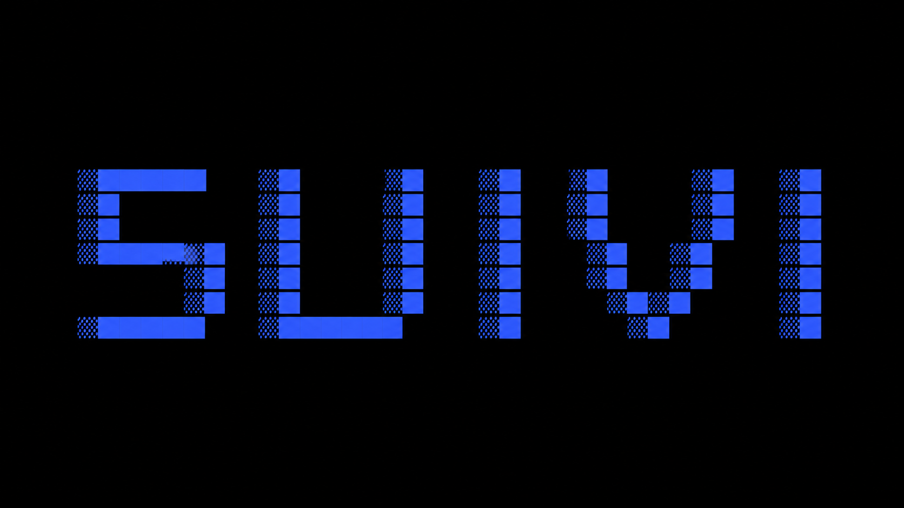

<div align="center">



**Track time spent working with AI coding agents across multiple projects.**

Hook into Claude Code, Codex, Pi, OpenCode and more — measure where your time actually goes, broken down by project, agent, and model.

[](https://github.com/hefgi/suivi/actions/workflows/ci.yml)
[](https://crates.io/crates/suivi)
[](https://github.com/hefgi/homebrew-tap)
[](LICENSE)
[](https://hefgi.github.io/suivi/)

---

**Built for developers running multiple AI agent sessions in parallel.**


and any agent that supports hooks or extensions.

</div>

## The problem

You're running 3 Claude Code sessions across different projects, a Codex session on another, and a Pi session reviewing a PR. At the end of the day you have no idea where your time went. Was it accounting? The new API? That refactor you kept context-switching into?

suivi hooks into every agent session automatically. Each prompt you send is a turn. Each turn is attributed to a project. At the end of the day — or week, or month — you see exactly where your time went, split by project, agent, and model.

> suivi is French for "tracking" — what you do when you follow something closely over time.

## Install

[](https://github.com/hefgi/homebrew-tap)

```bash
brew install hefgi/tap/suivi
```

[](https://crates.io/crates/suivi)

```bash
cargo install suivi
```

## Setup

```bash
suivi init
```

Creates `~/.config/suivi/config.toml`, detects installed agents, and registers hooks automatically.

## Usage

```bash
# Initialize and install hooks for all detected agents
suivi init

# View time stats
suivi stats              # today + this week + all time
suivi stats --projects   # per-project breakdown
suivi stats --graph      # ASCII activity graph (last 30 days)
suivi stats --daily      # daily table
suivi stats --history    # turn-by-turn history
suivi stats --all        # all-time view (no date window)

# Filter by project or agent
suivi stats --project <path>   # drill into one project
suivi stats --agent <name>     # drill into one agent

# Machine-readable output
suivi stats --format json
suivi stats --format csv

# Check hook health
suivi status

# Database maintenance
suivi doctor             # show stale turn counts
suivi doctor --prune     # delete stale turns and expired turns
suivi doctor --check     # SQLite integrity check
suivi doctor --fix-from-transcripts  # correct ended_at from Claude Code
                                     # transcripts (reclaims phantom time
                                     # from suspended/idle sessions)

# Remove suivi's hooks from all agent configs
suivi uninstall          # keeps your config and database
suivi uninstall --purge  # also delete config, database, and logs
```

## Configuration

`~/.config/suivi/config.toml`:

```toml
[tracking]
human_buffer_secs = 300  # time budgeted for reading/writing prompts (default: 5min)
retention_days = 365

[[projects]]
path = "~/code/my-project"

[[projects]]
path = "~/code/org/*"  # tracks each subdirectory individually
```

Project names default to the directory name. Add `name = "..."` to override.

## Wall-clock vs agent time

suivi tracks two time metrics:

- **Wall-clock** — attention time: the union of all turn intervals, padded by
  `human_buffer_secs` on each side to budget for reading and writing prompts.
  Two parallel sessions for 1 min = 1 min.
- **Agent time** — machine effort: the sum of each turn's real duration
  (prompt submitted → response finished). Two parallel sessions for
  1 min = 2 min.

Wall-clock tells you how much of your day a project occupied. Agent time
tells you how much the agents actually worked.

## Supported agents

| Agent | Status | Hook event |
|-------|--------|------------|
| Claude Code | ✅ v1 | `UserPromptSubmit` + `Stop` |
| Codex | ✅ v1 | `UserPromptSubmit` + `Stop` |
| Pi | ✅ v1 | `before_agent_start` + `agent_end` |
| OpenCode | ✅ v1 | `message.updated` (user messages) + `session.idle` |

## Contributing

Adding a new agent takes ~30 lines. See [CONTRIBUTING.md](CONTRIBUTING.md).

## License

MIT
